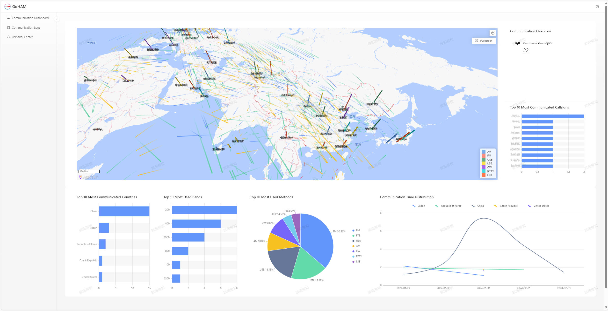
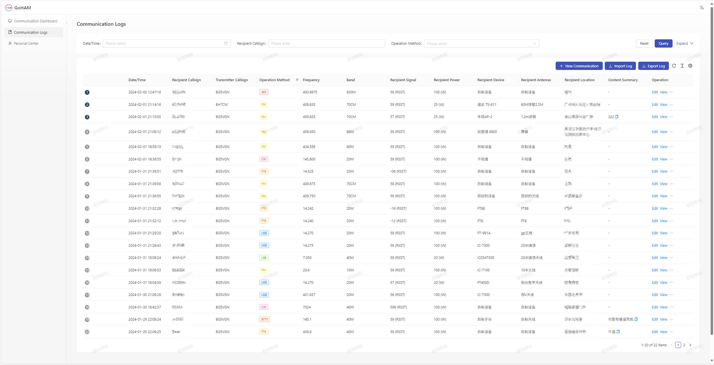
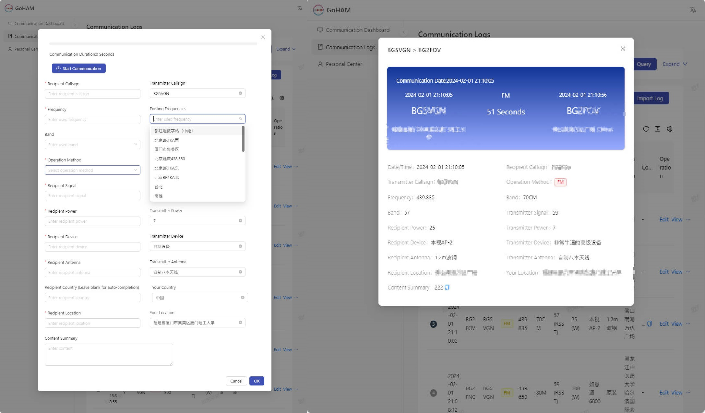
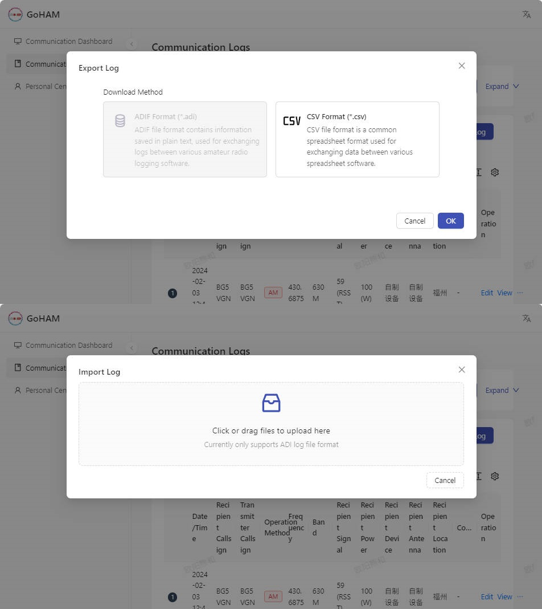
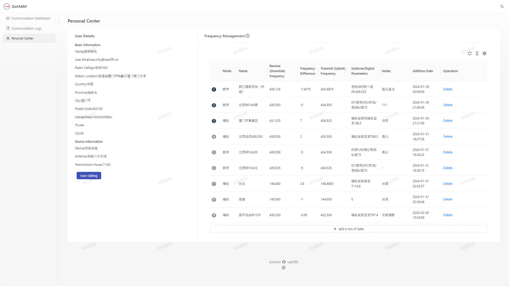

# GoHAM

> A radio log communication recording system suitable for HAM

[中文](./README-zh.md)| English | [日本語](./README-jp.md)

> [!IMPORTANT]
> This project is still in development. If you encounter bugs or urgently need some functional suggestions, please open an [ISSUE](https://github.com/icecliffs/GoHAM/issues) or send an email.

Experience it here: [https://goham-1Ba34Da3c8-vmlinux.iloli.moe](https://goham-1Ba34Da3c8-vmlinux.iloli.moe)

## 🔧Features

- The most basic radio log recording
- Frequency management, communication log management, log export, etc
- Connected large screen for convenient, reliable, and intuitive discovery of connected data
- Support ADIF log import and export, facilitating quick system integration
- Supporting multi platform deployment, * * may consider adopting SaaS multi-user mode in the future, please stay tuned**
- Support client/server log connectivity, users can download and add logs from the client to the server by themselves~~
- Address: https://github.com/icecliffs/WSocketReflectorGoHAM

## 🔨 Deploy

#### Docker deployment (recommended)

` ` `
docker run icecliffs/goham:latest -p 11451:11451
` ` `

Manual compilation: The repository contains' docker-compose.yaml 'which can be customized according to requirements

#### Windows deployment

You can find the version you need to download in the Release interface. Because the database uses MySQL, you need to manually import the SQL file (' goham.sql ').

After configuring the corresponding account and password port number in 'config.yaml', run it directly

` ` `
goham.exe
` ` `

Be enough

#### Linux deployment

You can find the version you need to download in the Release interface. Because the database uses MySQL, you need to manually import the SQL file (' goham.sql ').

After configuring the corresponding account and password port number in 'config.yaml', run it directly

` ` `
./goham
` ` `

Be enough

## 🐴Demo

## 🌏关于i18n

Currently adapted for Simplified Chinese, Traditional Chinese, Japanese (google translation), and English (google translation). If you encounter translation errors, please open an [ISSUE](https://github.com/icecliffs/GoHAM/issues) or email. Urgently need translation masters, if you are interested, please contact me.