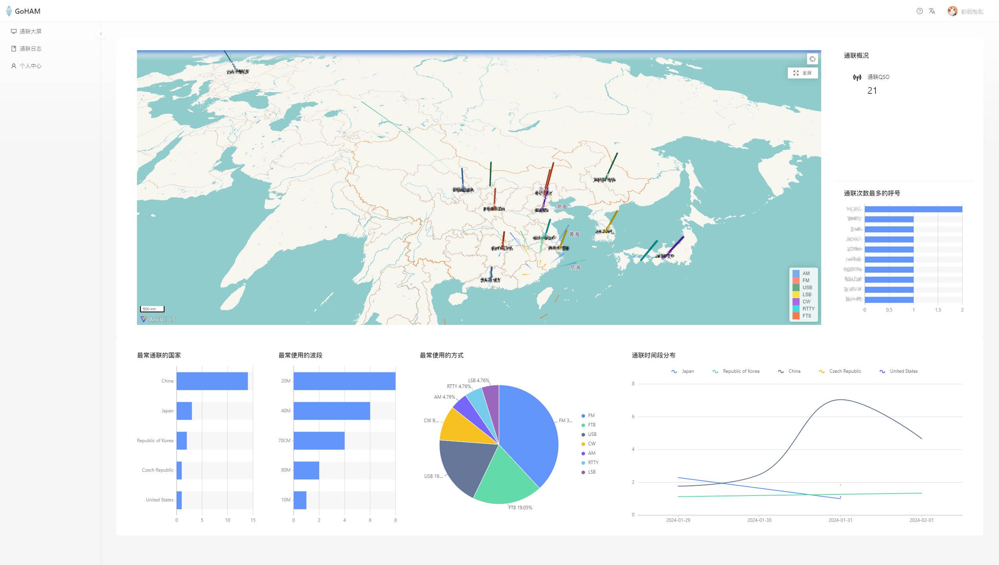

# GoHAM

> 一款适用于无线电爱好者们的无线电日志通联纪录系统

中文 | [English](./README-en.md) | [日本語](./README-jp.md)

> [!IMPORTANT]
> 该项目还在开发中，如遇到BUG或急需一些功能性的建议可以提个 [ISSUE](https://github.com/icecliffs/GoHAM/issues) 或发送电子邮件

体验地址：[https://goham-1Ba34Da3c8-vmlinux.iloli.moe](https://goham-1Ba34Da3c8-vmlinux.iloli.moe)

## 🔧功能

- 支持2FA登录校验，登陆更快捷
- 最基本的电台日志记录
  - 频率管理、通联日志管理、日志导出等等
- 通联大屏，方便可靠直观发现通联数据
- 支持 ADIF 日志导入及导出，方便快速对接系统
- 支持关联 LoTW 系统，方便快速导入日志
- 支持多平台部署，**后续可能会考虑采用SaaS多用户模式，敬请期待**
- ~~支持客户端/服务端日志通联，用户可自行下载客户端添加日志至服务端~~~~
  - 地址：https://github.com/icecliffs/WSocketReflectorGoHAM

## 🐴Demo

## 🌏关于i18n

目前适配了简体中文、繁体中文、日语（机翻）、英语（机翻），如遇到翻译错误可提 [ISSUE](https://github.com/icecliffs/GoHAM/issues) 或电子邮件，急需翻译大佬，如果有要的可以联系我
